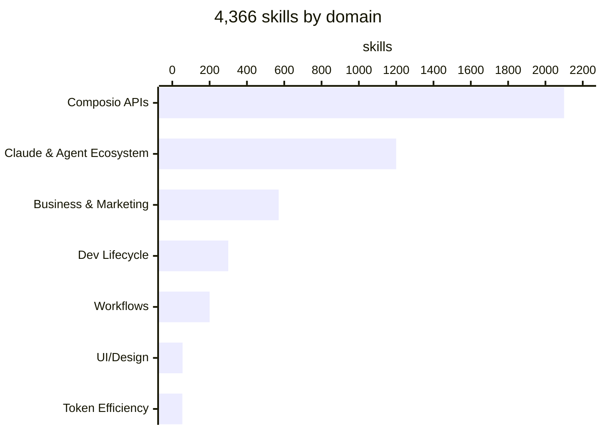
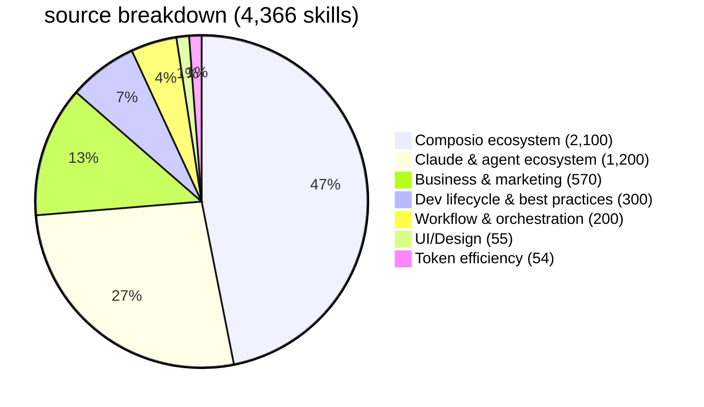
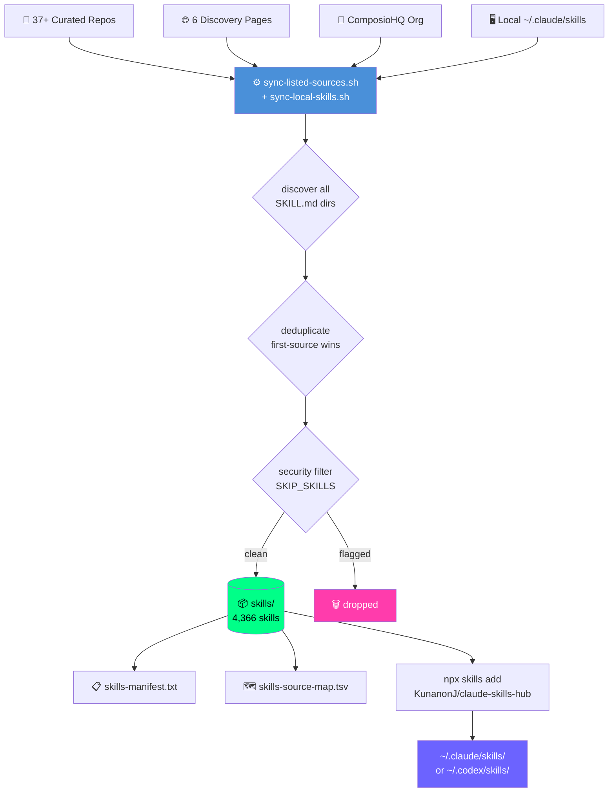

<div align="center">

# ⚡ claude-skills-hub

### the biggest open-source skill drop for AI coding agents. period.

**4,366 skills. 37+ repos. one install.**

[](./skills/)
[](.)
[](./skills-source-map.tsv)
[](.)
[](https://github.com/KunanonJ/claude-skills-hub/stargazers)

<br/>

```bash
npx skills add KunanonJ/claude-skills-hub -g -a claude-code -s '*' --copy -y
```

*works with Claude Code · ChatGPT Codex · Cursor · Gemini CLI · Windsurf*

</div>

---

## 🔥 what you're getting

no fluff. just numbers.

| | |
|---|---|
| 📦 skills | **4,366** |
| 🗂️ sources scraped | **37+** repos |
| 🔌 plugins | **49** (LSPs, services, workflows) |
| 🔗 MCP servers | **15** documented |
| 🤖 compatible agents | **6** — Claude · Codex · Cursor · Gemini · Windsurf · OpenClaw |
| 🚫 security-flagged skills removed | **1** (`agent-browser`) |



---

## ⚡ install in 10 seconds

### claude code — all 4,366 skills

```bash
npx skills add KunanonJ/claude-skills-hub -g -a claude-code -s '*' --copy -y
```

### codex — same corpus, different target

```bash
npx skills add KunanonJ/claude-skills-hub -g -a codex -s '*' --copy -y
```

### manual rsync (works everywhere)

```bash
git clone --depth 1 https://github.com/KunanonJ/claude-skills-hub.git /tmp/csh
rsync -a /tmp/csh/skills/ ~/.claude/skills/   # or ~/.codex/skills/
```

### full setup — skills + plugins + MCPs (one liner)

```bash
bash <(curl -fsSL https://gist.githubusercontent.com/KunanonJ/f7e7c9b8c45d927ae03b84b1879d384d/raw/setup-claude.sh)
```

---

## 🎯 cherry-pick your stack

don't want all 4k? grab exactly what you need.

```bash
# 🏗️ engineering
npx skills add KunanonJ/claude-skills-hub/karpathy-guidelines -g -y
npx skills add KunanonJ/claude-skills-hub/spec-driven-development -g -y
npx skills add KunanonJ/claude-skills-hub/lighthouse-agentic-browsing -g -y
npx skills add KunanonJ/claude-skills-hub/startup-cto -g -y

# 🎨 ui/design
npx skills add KunanonJ/claude-skills-hub/ui-ux-pro-max -g -y    # 67 styles, 161 palettes
npx skills add KunanonJ/claude-skills-hub/taste-skill -g -y

# 📈 business & strategy
npx skills add KunanonJ/claude-skills-hub/business-strategy-planning -g -y
npx skills add KunanonJ/claude-skills-hub/competitive-intel -g -y

# 🔍 marketing & seo
npx skills add KunanonJ/claude-skills-hub/aeo -g -y               # answer engine optimization
npx skills add KunanonJ/claude-skills-hub/seo-strategy -g -y
npx skills add KunanonJ/claude-skills-hub/content-strategist -g -y
```

---

## 🗂️ what's inside



<details>
<summary><strong>📋 full source list (37+ repos)</strong></summary>

| repo | what's in it | skills |
|------|-------------|--------|
| [ComposioHQ/awesome-claude-skills](https://github.com/ComposioHQ/awesome-claude-skills) | API integrations | ~1,200 |
| [ComposioHQ org](https://github.com/ComposioHQ) | more integrations | ~900 |
| [alirezarezvani/claude-skills](https://github.com/alirezarezvani/claude-skills) | C-suite · eng · marketing · compliance | ~283 |
| [sickn33/antigravity-awesome-skills](https://github.com/sickn33/antigravity-awesome-skills) | community pack | ~200 |
| [affaan-m/everything-claude-code](https://github.com/affaan-m/everything-claude-code) | ECC — 62 agents, 235 skills | ~229 |
| [obra/superpowers](https://github.com/obra/superpowers) | workflow orchestration | ~40 |
| [addyosmani/agent-skills](https://github.com/addyosmani/agent-skills) | dev lifecycle | ~20 |
| [expo/skills](https://github.com/expo/skills) | React Native / Expo | 16 |
| [nextlevelbuilder/ui-ux-pro-max-skill](https://github.com/nextlevelbuilder/ui-ux-pro-max-skill) | 67 styles · 161 palettes | 1 |
| [Leonxlnx/taste-skill](https://github.com/Leonxlnx/taste-skill) | design aesthetics | 13 |
| [ParthJadhav/app-store-screenshots](https://github.com/ParthJadhav/app-store-screenshots) | App Store mockups | 1 |
| [ShunsukeHayashi/miyabi](https://mcpmarket.com/tools/skills/business-strategy-planning-1) | 8-phase business planning | 1 |
| [anthropics/skills](https://github.com/anthropics/skills) | official Anthropic | ~10 |
| [rtk-ai/rtk](https://github.com/rtk-ai/rtk) | token efficiency | ~7 |
| [juliusbrussee/caveman](https://github.com/juliusbrussee/caveman) | token compression | 5 |
| [ruvnet/ruflo](https://github.com/ruvnet/ruflo) | orchestration | ~15 |
| [ericvtheg/solo-founder-toolkit](https://github.com/ericvtheg/solo-founder-toolkit) | founder tools | ~8 |
| [ognjengt/founder-skills](https://github.com/ognjengt/founder-skills) | founder | ~6 |
| [mylukin/agent-foreman](https://github.com/mylukin/agent-foreman) | agent orchestration | ~6 |
| [thedotmack/claude-mem](https://github.com/thedotmack/claude-mem) | memory / context | ~5 |
| [czlonkowski/n8n-skills](https://github.com/czlonkowski/n8n-skills) | automation | ~5 |
| [muratcankoylan/ralph-wiggum-marketer](https://github.com/muratcankoylan/ralph-wiggum-marketer) | marketing | ~4 |
| [Exploration-labs/Nates-Substack-Skills](https://github.com/Exploration-labs/Nates-Substack-Skills) | writing | ~4 |
| [FlorianBruniaux/claude-code-ultimate-guide](https://github.com/FlorianBruniaux/claude-code-ultimate-guide) | general | ~10 |
| [dazuck/operator-skills](https://github.com/dazuck/operator-skills) | operator | ~5 |
| [team-attention/plugins-for-claude-natives](https://github.com/team-attention/plugins-for-claude-natives) | plugins | ~5 |
| [forrestchang/andrej-karpathy-skills](https://github.com/forrestchang/andrej-karpathy-skills) | best practices | 1 |
| [shanraisshan/claude-code-best-practice](https://github.com/shanraisshan/claude-code-best-practice) | best practices | 4 |
| [kubony/claude-session-wrap](https://github.com/kubony/claude-session-wrap) | session management | ~3 |
| [vercel-labs/skills](https://github.com/vercel-labs/skills) | discovery | 1 |

plus skills from [hesreallyhim/awesome-claude-code](https://github.com/hesreallyhim/awesome-claude-code), [VoltAgent/awesome-agent-skills](https://github.com/VoltAgent/awesome-agent-skills), [awesomeclaude.ai](https://awesomeclaude.ai/awesome-claude-skills), and more.

</details>

---

## 🔌 plugins (49 installed)

```bash
# workflow essentials
for plugin in typescript-lsp security-guidance code-review playwright \
              context7 pr-review-toolkit feature-dev ralph-loop \
              session-report hookify skill-creator; do
  claude plugin install "$plugin"
done

# language servers (inline IDE intelligence)
for plugin in clangd-lsp csharp-lsp gopls-lsp jdtls-lsp kotlin-lsp \
              lua-lsp php-lsp pyright-lsp ruby-lsp rust-analyzer-lsp swift-lsp; do
  claude plugin install "$plugin"
done

# service integrations
for plugin in github mongodb notion railway sentry stripe telegram \
              postman sanity resend; do
  claude plugin install "$plugin"
done
```

---

## 🔗 MCP servers worth adding

```bash
# free — no key needed
claude mcp add --transport stdio context7       -- npx -y @upstash/context7-mcp
claude mcp add --transport stdio exa            -- npx -y exa-mcp-server
claude mcp add --transport stdio context-mode   -- npx -y context-mode
claude mcp add --transport stdio token-savior   -- uvx token-savior-recall

# LINE OA — AI-powered messaging (Thai 🇹🇭 ready)
claude mcp add --transport stdio line -- npx -y line-oa-mcp-ultimate
# needs: LINE_CHANNEL_ACCESS_TOKEN

# code-review-graph — 49× token savings on code review
uv tool install code-review-graph
code-review-graph install --platform claude-code
code-review-graph build
```

---

## ⚙️ how it's built



| property | how it works |
|---|---|
| **precedence** | first repo in `SOURCE_INPUTS` wins on name collision |
| **traceability** | every skill maps back to its origin in `skills-source-map.tsv` |
| **safety** | `SKIP_SKILLS` removes flagged skills after sync |
| **portability** | zero `.git` metadata in `skills/` — clone and commit safely |

### keep it fresh

```bash
bash sync-listed-sources.sh
git add skills/ skills-manifest.txt skills-source-map.tsv
git commit -m "chore: sync skills $(date +%Y-%m-%d)"
git push
```

---

## 🤝 contribute

the corpus grows because people add to it. here's how.

**add a new skill source:**
1. open `sync-listed-sources.sh`
2. add to `SOURCE_INPUTS`:
   ```python
   {"kind": "repo", "repo": "owner/repo-name"},
   ```
3. run `bash sync-listed-sources.sh`
4. open a PR with updated `skills/`, `skills-manifest.txt`, `skills-source-map.tsv`

**drop a single skill directly:**
1. create `skills/your-skill-name/SKILL.md`
2. follow the [SKILL.md format](./skills/karpathy-guidelines/SKILL.md) — frontmatter + instructions
3. PR it in

**flag a bad skill:**
```python
# sync-listed-sources.sh
SKIP_SKILLS: set[str] = {
    "agent-browser",   # Snyk High Risk
    "your-skill",      # reason here
}
```

---

<div align="center">

**[browse skills/](./skills/) · [source map](./skills-source-map.tsv) · [releases](https://github.com/KunanonJ/claude-skills-hub/releases)**

drop a ⭐ if this hits different

</div>
