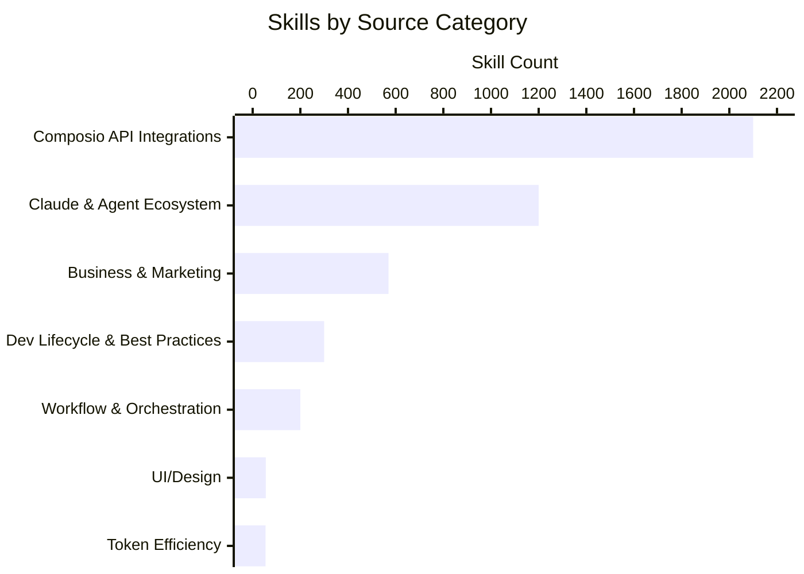
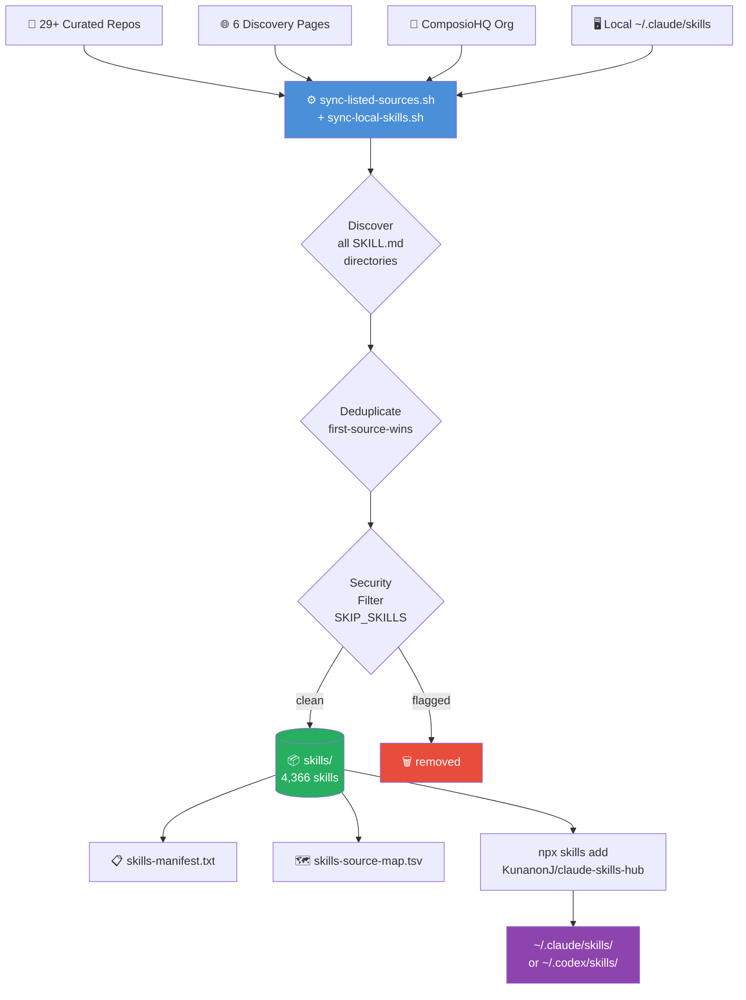
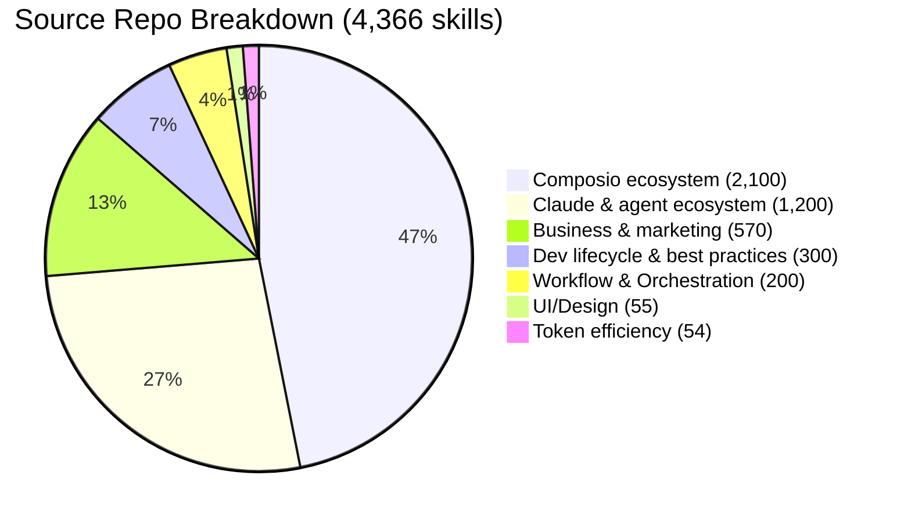
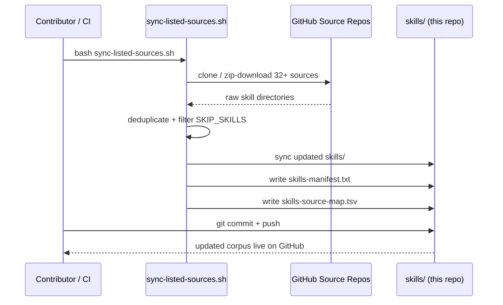

<div align="center">

# 🧠 Claude Skills Hub

**4,366 portable `SKILL.md` skills for Claude Code, ChatGPT Codex, Cursor, Gemini CLI, Windsurf, and other AI coding agents.**

[](./skills/)
[](./skills-source-map.tsv)
[](.)
[](.)
[](https://github.com/KunanonJ/claude-skills-hub/stargazers)

<br/>

```
npx skills add KunanonJ/claude-skills-hub -g -a claude-code -s '*' --copy -y
```

*One portable skill corpus. Use it from Claude Code, ChatGPT Codex, Cursor, Gemini CLI, Windsurf, and more.*

</div>

---

## 🤖 Why This Exists

`claude-skills-hub` is a curated, constantly-growing corpus of `SKILL.md` skills for every major AI coding agent. Each skill is a directory with a `SKILL.md` entrypoint — the same format works across Claude Code, Codex, Cursor, and Gemini CLI without modification.

Use this repo as:

| Agent / Client | Recommended install target | Notes |
|---|---|---|
| **Claude Code** | `npx skills add ...` or `~/.claude/skills` | Primary target — full plugin + MCP ecosystem |
| **ChatGPT Codex / OpenAI Codex** | `~/.codex/skills` | Direct local skill loading for Codex Desktop / CLI |
| **Cursor / Windsurf / Gemini CLI** | Agent-specific skill or MCP configuration | Same `SKILL.md` bodies work as reusable instructions |

> The previous `codex-skills-hub` URL automatically redirects here.

## 📊 Skill Corpus at a Glance



| Metric | Value |
|--------|-------|
| 📦 Total skills in [`skills/`](./skills/) | **4,366** |
| 🗂️ Source repos tracked | **37+** |
| 🌐 Discovery pages crawled | **6** |
| 🔌 Claude Code plugins | **49** |
| 🔗 MCP servers | **15** |
| 🚫 Excluded (security flags) | **1** (`agent-browser`) |
| 🤖 Compatible agents | Claude Code · ChatGPT Codex · OpenAI Codex · Cursor · Gemini CLI · Windsurf |

---

## ⚡ Quick Install

### Claude Code

#### All 4,366 skills in one shot

```bash
npx skills add KunanonJ/claude-skills-hub -g -a claude-code -s '*' --copy -y
```

#### Cherry-pick a single skill

Browse [`skills/`](./skills/) → find what you want → install by path:

```bash
# Engineering
npx skills add KunanonJ/claude-skills-hub/karpathy-guidelines -g -y
npx skills add KunanonJ/claude-skills-hub/spec-driven-development -g -y
npx skills add KunanonJ/claude-skills-hub/lighthouse-agentic-browsing -g -y

# UI/Design
npx skills add KunanonJ/claude-skills-hub/ui-ux-pro-max -g -y
npx skills add KunanonJ/claude-skills-hub/taste-skill -g -y

# Business & Strategy
npx skills add KunanonJ/claude-skills-hub/business-strategy-planning -g -y
npx skills add KunanonJ/claude-skills-hub/startup-cto -g -y
npx skills add KunanonJ/claude-skills-hub/competitive-intel -g -y

# Marketing & SEO
npx skills add KunanonJ/claude-skills-hub/aeo -g -y
npx skills add KunanonJ/claude-skills-hub/seo-strategy -g -y
npx skills add KunanonJ/claude-skills-hub/content-strategist -g -y
```

#### Full environment — skills + plugins + MCPs

```bash
bash <(curl -fsSL https://gist.githubusercontent.com/KunanonJ/f7e7c9b8c45d927ae03b84b1879d384d/raw/setup-claude.sh)
```

### ChatGPT Codex / OpenAI Codex

Install all skills for Codex with the `skills` CLI:

```bash
npx skills add KunanonJ/claude-skills-hub -g -a codex -s '*' --copy -y
```

#### Manual Codex sync

```bash
git clone --depth 1 https://github.com/KunanonJ/claude-skills-hub.git /tmp/claude-skills-hub
cd /tmp/claude-skills-hub
mkdir -p ~/.codex/skills
rsync -a skills/ ~/.codex/skills/
```

Restart Codex after syncing so the new skills are discovered.

---

## 🔬 How the Corpus is Built



**Key design properties:**

| Property | Behaviour |
|---|---|
| **Precedence** | First repo in `SOURCE_INPUTS` wins on name collision |
| **Traceability** | Every skill maps to its origin in `skills-source-map.tsv` |
| **Safety** | `SKIP_SKILLS` set removes flagged skills post-sync |
| **Portability** | No `.git` metadata in `skills/` — safe to clone and commit |

---

## 🗂️ Skill Sources



### Curated repos

| Repo | Category | Skills |
|------|----------|--------|
| [ComposioHQ/awesome-claude-skills](https://github.com/ComposioHQ/awesome-claude-skills) | Composio ecosystem | ~1,200 |
| [ComposioHQ org](https://github.com/ComposioHQ) | Composio ecosystem | ~900 |
| [sickn33/antigravity-awesome-skills](https://github.com/sickn33/antigravity-awesome-skills) | Community | ~200 |
| [affaan-m/everything-claude-code](https://github.com/affaan-m/everything-claude-code) | Claude ecosystem | ~229 |
| [obra/superpowers](https://github.com/obra/superpowers) | Workflow orchestration | ~40 |
| [addyosmani/agent-skills](https://github.com/addyosmani/agent-skills) | Dev lifecycle | ~20 |
| [expo/skills](https://github.com/expo/skills) | React Native / Expo | 12 |
| [nextlevelbuilder/ui-ux-pro-max-skill](https://github.com/nextlevelbuilder/ui-ux-pro-max-skill) | UI/UX design | 1 (67 styles, 161 palettes) |
| [Leonxlnx/taste-skill](https://github.com/Leonxlnx/taste-skill) | UI/Design aesthetics | 13 |
| [ParthJadhav/app-store-screenshots](https://github.com/ParthJadhav/app-store-screenshots) | App Store assets | 1 |
| [juliusbrussee/caveman](https://github.com/juliusbrussee/caveman) | Token compression | 5 |
| [forrestchang/andrej-karpathy-skills](https://github.com/forrestchang/andrej-karpathy-skills) | Best practices | 1 |
| [shanraisshan/claude-code-best-practice](https://github.com/shanraisshan/claude-code-best-practice) | Best practices | 4 |
| [rtk-ai/rtk](https://github.com/rtk-ai/rtk) | Token efficiency | ~7 |
| [anthropics/skills](https://github.com/anthropics/skills) | Official Anthropic | ~10 |
| [thedotmack/claude-mem](https://github.com/thedotmack/claude-mem) | Memory / context | ~5 |
| [ruvnet/ruflo](https://github.com/ruvnet/ruflo) | Orchestration | ~15 |
| [FlorianBruniaux/claude-code-ultimate-guide](https://github.com/FlorianBruniaux/claude-code-ultimate-guide) | General | ~10 |
| [ericvtheg/solo-founder-toolkit](https://github.com/ericvtheg/solo-founder-toolkit) | Founder | ~8 |
| [ognjengt/founder-skills](https://github.com/ognjengt/founder-skills) | Founder | ~6 |
| [dazuck/operator-skills](https://github.com/dazuck/operator-skills) | Operator | ~5 |
| [alirezarezvani/claude-skills](https://github.com/alirezarezvani/claude-skills) | C-suite, engineering, marketing, compliance | ~283 |
| [ShunsukeHayashi/miyabi](https://mcpmarket.com/tools/skills/business-strategy-planning-1) | Business strategy (Miyabi 8-phase) | 1 |
| [emotixco/claude-skills-founder](https://github.com/emotixco/claude-skills-founder) | Founder | ~5 |
| [Exploration-labs/Nates-Substack-Skills](https://github.com/Exploration-labs/Nates-Substack-Skills) | Writing | ~4 |
| [kubony/claude-session-wrap](https://github.com/kubony/claude-session-wrap) | Session management | ~3 |
| [team-attention/plugins-for-claude-natives](https://github.com/team-attention/plugins-for-claude-natives) | Plugins | ~5 |
| [czlonkowski/n8n-skills](https://github.com/czlonkowski/n8n-skills) | Automation | ~5 |
| [mylukin/agent-foreman](https://github.com/mylukin/agent-foreman) | Agent orchestration | ~6 |
| [muratcankoylan/ralph-wiggum-marketer](https://github.com/muratcankoylan/ralph-wiggum-marketer) | Marketing | ~4 |
| [vercel-labs/skills](https://github.com/vercel-labs/skills) | skills.sh discovery | 1 |
| [punkpeye/awesome-mcp-servers](https://github.com/punkpeye/awesome-mcp-servers) | MCP discovery | 1 |
| [nickclyde/duckduckgo-mcp-server](https://github.com/nickclyde/duckduckgo-mcp-server) | MCP / search | 1 |
| [crystaldba/postgres-mcp](https://github.com/crystaldba/postgres-mcp) | MCP / database | 1 |
| [merajmehrabi/puppeteer-mcp-server](https://github.com/merajmehrabi/puppeteer-mcp-server) | MCP / browser automation | 1 |

Plus skills discovered from [hesreallyhim/awesome-claude-code](https://github.com/hesreallyhim/awesome-claude-code), [VoltAgent/awesome-agent-skills](https://github.com/VoltAgent/awesome-agent-skills), [awesomeclaude.ai](https://awesomeclaude.ai/awesome-claude-skills), and more.

---

## 🔌 Optional Claude Code Plugins

These plugin commands are Claude Code-specific. Codex users can use the skill corpus directly from `~/.codex/skills` and configure MCP servers in `~/.codex/config.toml`.

**49 plugins installed** across 3 marketplaces: `claude-plugins-official`, `cloudflare`, `claude-code-warp`.

```bash
# Core workflow plugins
for plugin in typescript-lsp security-guidance code-review playwright \
              context7 pr-review-toolkit feature-dev ralph-loop \
              session-report hookify skill-creator; do
  claude plugin install "$plugin"
done

# LSP plugins (language intelligence)
for plugin in clangd-lsp csharp-lsp gopls-lsp jdtls-lsp kotlin-lsp \
              lua-lsp php-lsp pyright-lsp ruby-lsp rust-analyzer-lsp swift-lsp; do
  claude plugin install "$plugin"
done

# Service integrations
for plugin in github mongodb notion railway sentry stripe telegram \
              postman sanity resend; do
  claude plugin install "$plugin"
done
```

---

## 🔗 MCP Server Recipes

The examples below use Claude Code's `claude mcp add` syntax. For Codex, add equivalent entries under `[mcp_servers.<name>]` in `~/.codex/config.toml`.

### No API key required

```bash
claude mcp add --transport stdio context7       -- npx -y @upstash/context7-mcp
claude mcp add --transport stdio context-mode   -- npx -y context-mode
claude mcp add --transport stdio exa            -- npx -y exa-mcp-server
claude mcp add --transport stdio investor-agent -- npx -y investor-agent
claude mcp add --transport stdio token-savior   -- uvx token-savior-recall
```

### LINE Official Account — AI-driven messaging

```bash
claude mcp add --transport stdio line -- npx -y line-oa-mcp-ultimate
# Set env: LINE_CHANNEL_ACCESS_TOKEN=<your token>
```

> 27 tools: send messages, rich menus, Flex messages, audiences, insights, coupons, LIFF management. Thai-localized templates. Source: [wasintoh/line-oa-mcp-ultimate](https://github.com/wasintoh/line-oa-mcp-ultimate)

### `code-review-graph` — Tree-sitter knowledge graph

```bash
uv tool install code-review-graph
code-review-graph install --platform claude-code  # run inside your project
code-review-graph build
```

> Reduces code review token usage by up to **49×** by scoping context to blast-radius only.

### Requires API keys

```bash
claude mcp add --transport stdio 2slides     -- npx -y mcp-2slides
claude mcp add --transport http  slidespeak  https://mcp.slidespeak.co/mcp
claude mcp add --transport http  plusai      https://mcp.plusai.com/
claude mcp add --transport http  CustomerIO  https://mcp.customer.io/mcp
```

---

## 🔄 Keeping the Corpus Fresh



```bash
# Run inside repo root
bash sync-listed-sources.sh

git add skills/ skills-manifest.txt skills-source-map.tsv
git commit -m "chore: sync skills $(date +%Y-%m-%d)"
git push
```

---

## 🤝 Contributing

### Add a skill source

1. Open `sync-listed-sources.sh`
2. Add to `SOURCE_INPUTS`:
   ```python
   {"kind": "repo", "repo": "owner/repo-name"},
   ```
3. Run `bash sync-listed-sources.sh`
4. Open a PR with updated `skills/`, `skills-manifest.txt`, `skills-source-map.tsv`

### Flag an unsafe skill

Add the skill name to `SKIP_SKILLS` in `sync-listed-sources.sh`:

```python
SKIP_SKILLS: set[str] = {
    "agent-browser",  # Snyk High Risk — juliusbrussee caveman repo
    "your-skill",     # reason
}
```

---

<div align="center">

**Browse [`skills/`](./skills/) · Check [`skills-source-map.tsv`](./skills-source-map.tsv) · Star ⭐ if useful**

</div>
